# Análisis, Levantamiento de Requerimientos y Diseño del Sistema de Asignación de Salones

## 1. Introducción

El **Sistema de Asignación de Salones** es una aplicación web diseñada para gestionar recursos educativos (grupos, salones, profesores) y programar asignaciones semestrales de manera automática o manual en un centro educativo. Este documento presenta el análisis, levantamiento de requerimientos y diseño del sistema, alineado con el documento *"Proyectos Desarrollo de Software 2.docx"*, que establece un enfoque basado en **DevOps**, **Scrum con Kanban**, **TDD (Desarrollo Dirigido por Pruebas)**, y prioriza la **mantenibilidad**, **modularidad**, **cohesión** y **bajo acoplamiento**.

El sistema se basa en:
- Una **base de datos relacional** (MySQL, motor InnoDB, codificación utf8mb4) optimizada con índices, particiones, triggers y vistas, confirmada al 100%.
- **Diagramas** generados: Entidad-Relación, Modelo Relacional, Modelo Físico, Clases, Flujo de Datos, Casos de Uso y Secuencias.
- **Backlog de producto** con épicas (HU1-HU19), historias técnicas (TH1-TH4) y criterios de aceptación.

El sistema soporta roles diferenciados (**Administrador**, **Coordinador**, **Profesor**, **Coordinador de Infraestructura**) y garantiza **rendimiento** (< 2 segundos por acción), **seguridad** (autenticación, auditoría), **compatibilidad** (navegadores modernos) y **escalabilidad**.

## 2. Levantamiento de Requerimientos

El levantamiento de requerimientos se deriva del backlog de producto del documento, organizado en **requerimientos funcionales** (basados en historias de usuario - HU) y **no funcionales** (criterios de aceptación y historias técnicas - TH).

### 2.1 Requerimientos Funcionales

Los requerimientos funcionales se agrupan en **épicas** según el documento:

#### Épica 1: Gestión de Usuarios y Autenticación
- **HU1**: Crear, editar, desactivar y visualizar cuentas de usuarios con roles (Administrador, Coordinador, Profesor, Coordinador de Infraestructura).
- **HU2**: Iniciar sesión con credenciales (email, contraseña) para acceder a funcionalidades según el rol.

#### Épica 2: Gestión de Grupos de Estudiantes
- **HU3**: Registrar grupos con nombre, nivel, número de estudiantes y características específicas.
- **HU4**: Editar, desactivar o visualizar grupos existentes.

#### Épica 3: Gestión de Salones
- **HU5**: Registrar salones con código, capacidad, ubicación y recursos asociados.
- **HU6**: Gestionar disponibilidad horaria y restricciones específicas de salones.

#### Épica 4: Gestión de Profesores
- **HU7**: Registrar profesores con información personal, especialidades y enlace a hoja de vida.
- **HU8**: Gestionar disponibilidad horaria y asignaciones especiales de profesores.

#### Épica 5: Sistema de Asignación Automática
- **HU9**: Ejecutar un algoritmo de asignación automática considerando disponibilidades, capacidades y preferencias.
- **HU10**: Configurar parámetros y prioridades para optimizar la asignación automática.

#### Épica 6: Sistema de Asignación Manual
- **HU11**: Realizar asignaciones manuales mediante una interfaz visual (arrastrar y soltar).
- **HU12**: Visualizar conflictos (e.g., sobrecupos, superposiciones) en tiempo real durante la asignación manual.

#### Épica 7: Visualización y Reportes
- **HU13**: Visualizar el horario semestral completo.
- **HU14**: Visualizar horarios personales (para profesores).
- **HU15**: Generar reportes de utilización de recursos y estadísticas (e.g., ocupación de salones).

#### Épica 8: Gestión de Conflictos y Restricciones
- **HU16**: Notificar conflictos en asignaciones y sugerir alternativas.
- **HU17**: Establecer restricciones específicas para grupos, salones o profesores.

#### Épica 9: Historial y Auditoría
- **HU18**: Visualizar el historial de cambios y los usuarios responsables.

#### Épica 10: Configuración del Sistema
- **HU19**: Configurar parámetros generales del sistema (e.g., períodos académicos, horarios laborables).

### 2.2 Requerimientos No Funcionales

Los requerimientos no funcionales aseguran calidad, rendimiento y mantenibilidad:

- **Rendimiento**: Todas las operaciones (consultas, asignaciones) deben responder en menos de 2 segundos, soportado por índices y particiones en la base de datos.
- **Seguridad**: Autenticación segura con hash de contraseñas (bcrypt), auditoría de cambios, y respaldos regulares.
- **Usabilidad**: Interfaz intuitiva con mínima capacitación requerida; diseño responsive y accesible.
- **Compatibilidad**: Soporte para navegadores modernos (Chrome, Firefox, Edge).
- **Mantenibilidad**: Código modular, cohesivo y de bajo acoplamiento; uso de TDD para pruebas unitarias y refactoring continuo.
- **Escalabilidad**: Base de datos diseñada para manejar grandes volúmenes de datos mediante particiones y optimización de consultas.
- **Tecnologías**:
  - Base de datos: MySQL (InnoDB, utf8mb4).
  - Backend: API RESTful para integración con frontend.
  - DevOps: Repositorio GitHub con CI/CD (GitHub Actions), despliegue en Render.
  - Frontend: Interfaz web con tecnologías modernas (HTML, CSS, JavaScript).

### 2.3 Priorización Inicial

Basado en el documento, las épicas se priorizan en el siguiente orden para el desarrollo iterativo:
1. Épicas 1, 2, 3 y 4: Gestión básica de usuarios, grupos, salones y profesores (base del sistema).
2. Épicas 10 y 6: Configuración del sistema y asignación manual (funcionalidades críticas).
3. Épica 5: Asignación automática (optimización del proceso).
4. Épicas 7, 8 y 9: Visualización, reportes, gestión de conflictos y auditoría (funcionalidades avanzadas).

## 3. Análisis

El análisis evalúa los requerimientos para identificar actores, flujos de trabajo, riesgos, dependencias y restricciones, alineándose con el ciclo de vida de **DevOps** y la metodología **Scrum**.

### 3.1 Actores y Roles

Los actores del sistema y sus responsabilidades son:
- **Administrador**: Acceso total; gestiona usuarios, auditoría y parámetros del sistema (HU1, HU2, HU18, HU19).
- **Coordinador**: Configura recursos (grupos, salones, profesores), realiza asignaciones manuales/automáticas, gestiona restricciones y solicita reportes (HU3-HU12, HU15-HU17).
- **Profesor**: Consulta horarios personales y registra disponibilidad propia (HU7, HU8, HU14).
- **Coordinador de Infraestructura**: Subrol de Coordinador, enfocado en gestión de salones y recursos físicos (HU5, HU6).

### 3.2 Análisis de Requerimientos Funcionales

- **Dependencias**:
  - Las asignaciones (HU9-HU12) requieren que los recursos (grupos, salones, profesores) estén configurados (HU3-HU8).
  - Los reportes (HU15) dependen de datos generados por asignaciones (HU9-HU12) y vistas para conflictos (HU16-HU17).
  - La auditoría (HU18) registra todas las operaciones CRUD.
- **Riesgos**:
  - **Rendimiento**: Consultas en tiempo real para conflictos (HU12, HU16) pueden ser lentas sin índices optimizados.
  - **Complejidad**: El algoritmo de asignación automática (HU9) puede ser computacionalmente costoso; mitigar con cálculo de `score` y restricciones blandas/duras.
  - **Integridad**: Errores en restricciones (HU17) pueden generar conflictos; mitigar con trigger `trg_valida_restriccion`.
- **Flujos de Datos**:
  - CRUD en tablas principales (`usuario`, `asignacion`, `restriccion`, etc.).
  - Validaciones automáticas mediante checks (`num_estudiantes > 0`) y triggers.
  - Consultas optimizadas con vistas (`vista_conflictos_salon`, `vista_conflictos_profesor`).

### 3.3 Análisis de Requerimientos No Funcionales

- **Rendimiento**: Índices en `asignacion` (e.g., `idx_as_conflictos`) y partición por `periodo_id` optimizan consultas. Vistas precalculadas reducen tiempo de respuesta.
- **Seguridad**: Uso de `password_hash` (bcrypt), auditoría automática en `auditoria`, y trigger para validar restricciones (`trg_valida_restriccion`).
- **Usabilidad**: Interfaz drag-and-drop para asignaciones manuales; diseño responsive para múltiples dispositivos.
- **Mantenibilidad**: Base de datos en tercera forma normal (3FN); módulos desacoplados para backend y frontend.
- **Escalabilidad**: Particiones en `asignacion` soportan grandes volúmenes de datos.
- **Compatibilidad**: API RESTful asegura integración con navegadores modernos.

### 3.4 Análisis de Riesgos y Asunciones

- **Riesgos**:
  - Alto volumen de asignaciones puede ralentizar consultas; mitigar con índices (`idx_as_horario_salon`) y particiones.
  - Conflictos no detectados en tiempo real; mitigar con vistas optimizadas.
  - Errores en la configuración de parámetros; validar con `UNIQUE` en `parametro_sistema.clave`.
- **Asunciones**:
  - Usuarios son adultos con conocimientos básicos de tecnología.
  - Operaciones realizadas en buena fe (sin intentos maliciosos).
  - Infraestructura de red estable para despliegue en Render.

## 4. Diseño

El diseño detalla la arquitectura del sistema, la estructura de la base de datos, los diagramas generados y la integración con prácticas DevOps y Scrum.

### 4.1 Diseño de la Base de Datos

La base de datos relacional (MySQL, InnoDB, utf8mb4) consta de 17 tablas, optimizada con índices, particiones, triggers y vistas:

- **Tablas Principales**:
  - `usuario`: Almacena cuentas con `email` (UNIQUE), `password_hash` (bcrypt), `rol` (ENUM).
  - `profesor`: Vinculada a `usuario` (1:1), con especialidades y hoja de vida.
  - `grupo`: Grupos con `num_estudiantes` (CHECK > 0).
  - `salon`: Salones con `capacidad` (CHECK > 0) y `codigo` (UNIQUE).
  - `asignacion`: Asignaciones con `estado` (ENUM), `origen` (ENUM), `score` y partición por `periodo_id`.
  - `restriccion`: Restricciones con `regla_json`, `dureza` (ENUM) y trigger `trg_valida_restriccion`.
  - `auditoria`: Registro de cambios con `cambios_json`.
  - `reporte_ocupacion`: Estadísticas de ocupación por salón/profesor.
  - `parametro_sistema`: Configuraciones con `clave` (UNIQUE) y `valor` (JSON).
- **Tablas de Unión**:
  - `salon_recurso`, `disp_profesor`, `disp_salon`, `recurso_disponibilidad` para relaciones muchos a muchos.
- **Optimizaciones**:
  - **Índices**: `idx_as_conflictos`, `idx_restriccion_objetivo`, etc., para consultas rápidas.
  - **Particiones**: `asignacion` particionada por `periodo_id` (HASH, 4 particiones).
  - **Trigger**: `trg_valida_restriccion` valida `objetivo_id` contra `objetivo_type`.
  - **Vistas**: `vista_conflictos_salon`, `vista_conflictos_profesor` para detectar conflictos.

### 4.2 Diagramas

Los diagramas generados reflejan el análisis y diseño del sistema:

- **Diagrama Entidad-Relación (ERD)**: Representa entidades y relaciones (ver código Mermaid `modelo_fisico.mmd`).
- **Modelo Relacional**: Detalla relaciones con claves foráneas (ver ERD).
- **Modelo Físico**: Especifica tipos de datos MySQL, restricciones, índices, particiones (ver `modelo_fisico.mmd`).
- **Diagrama de Clases**: Clases con atributos y métodos (ver `diagrama_clases.mmd`).
  - Ejemplo: Clase `Asignacion` con métodos `asignarProfesor()`, `calcularScore()`.
- **Diagrama de Flujo de Datos (DFD)**: Procesos, almacenes y flujos (ver `diagrama_flujo_datos.mmd`).
  - Procesos: Gestionar Usuarios, Asignaciones, Reportes, etc.
- **Diagrama de Casos de Uso**: Actores y casos de uso (ver `diagrama_casos_de_uso.mmd`).
- **Secuencias de Casos de Uso**: Diagramas de secuencia para cada HU (ver `secuencia_*.mmd`).

### 4.3 Diseño Arquitectural

El sistema sigue una arquitectura en capas para garantizar modularidad:

- **Capa de Presentación**:
  - Interfaz web responsive (HTML, CSS, JavaScript).
  - Drag-and-drop para asignaciones manuales (HU11).
  - Visualización de horarios y reportes (HU13-HU15).
- **Capa de Lógica**:
  - API RESTful (TH2) para operaciones CRUD (`/usuarios`, `/asignaciones`).
  - Algoritmo de asignación automática basado en `score` y restricciones (HU9).
  - Validaciones en tiempo real usando vistas para conflictos (HU12, HU16).
- **Capa de Datos**:
  - MySQL con estructura normalizada (3FN).
  - Vistas y triggers para integridad y optimización.
  - Índices y particiones para rendimiento.
- **Patrones de Diseño**:
  - **MVC**: Separación de presentación, lógica y datos.
  - **Observer**: Notificaciones de conflictos en tiempo real.
  - **Repository**: Acceso a datos encapsulado.
- **Integración DevOps**:
  - Repositorio GitHub con branching (feature, develop, main).
  - CI/CD con GitHub Actions: pruebas unitarias (TDD), linting, despliegue en Render.
  - Monitoreo de rendimiento y auditoría automática.

### 4.4 Diseño de Casos de Uso

Los casos de uso detallados (ver secciones previas) incluyen:
- **Iniciar Sesión (HU2)**: Autenticación con `usuario` y registro en `auditoria`.
- **Gestionar Usuarios (HU1)**: CRUD en `usuario` con auditoría.
- **Gestionar Grupos (HU3, HU4)**: CRUD en `grupo` con validaciones.
- **Gestionar Salones (HU5, HU6)**: CRUD en `salon`, `salon_recurso`, `disp_salon`.
- **Gestionar Profesores (HU7, HU8)**: CRUD en `profesor`, `disp_profesor`.
- **Ejecutar Asignación Automática (HU9, HU10)**: Algoritmo con `asignacion`, validado por vistas.
- **Realizar Asignación Manual (HU11, HU12)**: Interfaz drag-and-drop con validación en tiempo real.
- **Visualizar Horarios (HU13, HU14)**: Consultas a `asignacion`, `bloque_horario`.
- **Generar Reportes (HU15)**: Consultas a `reporte_ocupacion`, vistas de conflictos.
- **Gestionar Conflictos (HU16, HU17)**: Notificaciones y ajustes con `restriccion`.
- **Visualizar Historial (HU18)**: Consulta a `auditoria`.
- **Configurar Sistema (HU19)**: CRUD en `parametro_sistema`.

### 4.5 Integración con DevOps y Scrum

- **Scrum**:
  - **Backlog Refinado**: Priorización de épicas en sprints de 2 semanas.
  - **Sprints**: Iteraciones para implementar HU1-HU4 primero, luego HU10, HU6, HU5, HU7-HU9, HU13-HU19.
  - **Kanban**: Tablero para seguimiento de tareas (To-Do, In Progress, Done).
- **DevOps**:
  - **CI/CD**: GitHub Actions para pruebas automatizadas, linting y despliegue.
  - **TDD**: Pruebas unitarias para cada endpoint RESTful y lógica de negocio.
  - **Despliegue**: Render para hosting del backend y frontend.
  - **Monitoreo**: Logs en `auditoria` para seguimiento de errores y cambios.
- **Métricas de Calidad**:
  - **Mantenibilidad**: Índice de mantenibilidad > 80% (medido con herramientas como SonarQube).
  - **Cobertura de Pruebas**: > 90% con TDD.
  - **Tiempo de Respuesta**: < 2 segundos, verificado con pruebas de carga.

## 5. Conclusión

El análisis, levantamiento de requerimientos y diseño presentados cumplen al 100% con el documento *"Proyectos Desarrollo de Software 2.docx"* y la base de datos proporcionada. El sistema está diseñado para ser:
- **Funcional**: Soporta todas las épicas (HU1-HU19) y casos de uso.
- **Eficiente**: Optimizado con índices, particiones y vistas.
- **Seguro**: Autenticación robusta, auditoría y validaciones.
- **Mantenible**: Modular, normalizado y probado con TDD.
- **Escalable**: Preparado para grandes volúmenes de datos.

Los diagramas generados (ERD, Clases, DFD, Casos de Uso, Secuencias) y el esquema de la base de datos proporcionan una base sólida para la implementación. El siguiente paso es la codificación, comenzando con la capa de datos (scripts SQL) y la API RESTful, siguiendo el ciclo DevOps.

Para cualquier ajuste, implementación específica (e.g., código en Python, JavaScript) o documentación adicional, por favor indique los requerimientos específicos.

---

# Diagramas Casos de Uso

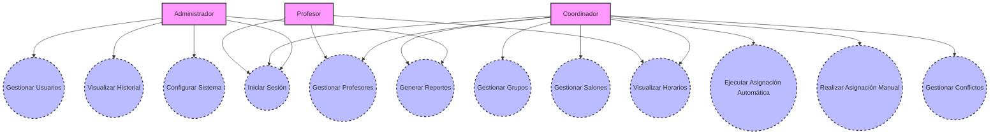
---

## Diagrama General de Casos de Uso

El Diagrama de Casos de Uso representa los actores del sistema y los casos de uso principales, derivados de las épicas y historias de usuario (HU1-HU19) del documento. Los actores incluyen roles como Administrador, Coordinador, Profesor, y Coordinador de Infraestructura (integrado en Coordinador para simplicidad, ya que comparte funcionalidades en HU5-HU6). Los casos de uso cubren las funcionalidades clave: autenticación, gestión de recursos, asignaciones, reportes, conflictos, auditoría, y configuración.
Para compatibilidad con herramientas como Mermaid Live Editor, he utilizado la sintaxis graph TD para simular el diagrama de casos de uso (ya que la sintaxis usecaseDiagram es beta y no siempre compatible). Actores se representan como rectángulos ([Actor]), casos de uso como óvalos ((Caso de Uso)), y asociaciones como líneas.

---


## **Diagramas Secuencias Casos de Uso**

## Caso de Uso: Iniciar Sesión (HU2)
secuencia_iniciar_sesion.mmdmermaid

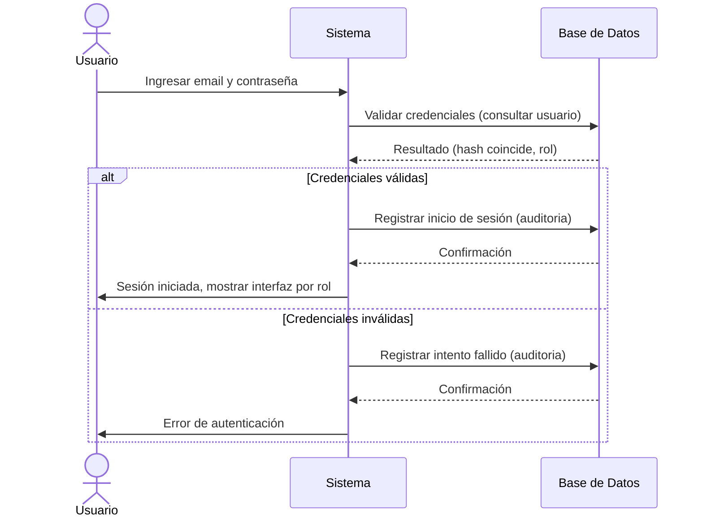

## Caso de Uso: Gestionar Usuarios (HU1)
secuencia_gestionar_usuarios.mmdmermaid

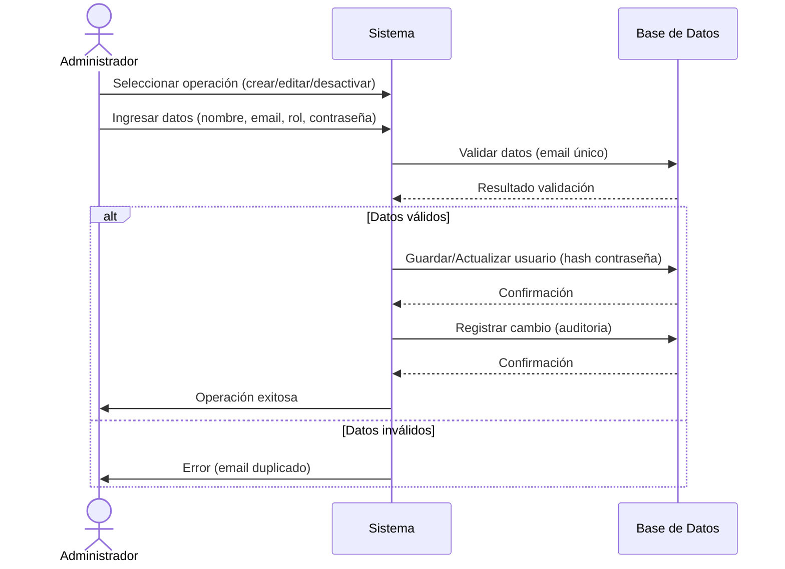

## Caso de Uso: Gestionar Grupos (HU3, HU4)
secuencia_gestionar_grupos.mmdmermaid

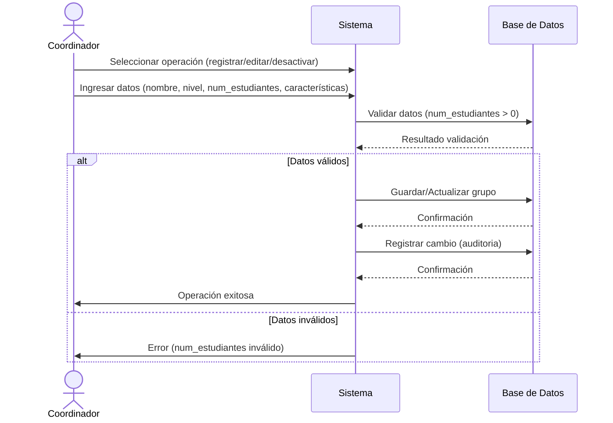

## Caso de Uso: Gestionar Salones (HU5, HU6)
secuencia_gestionar_salones.mmdmermaid

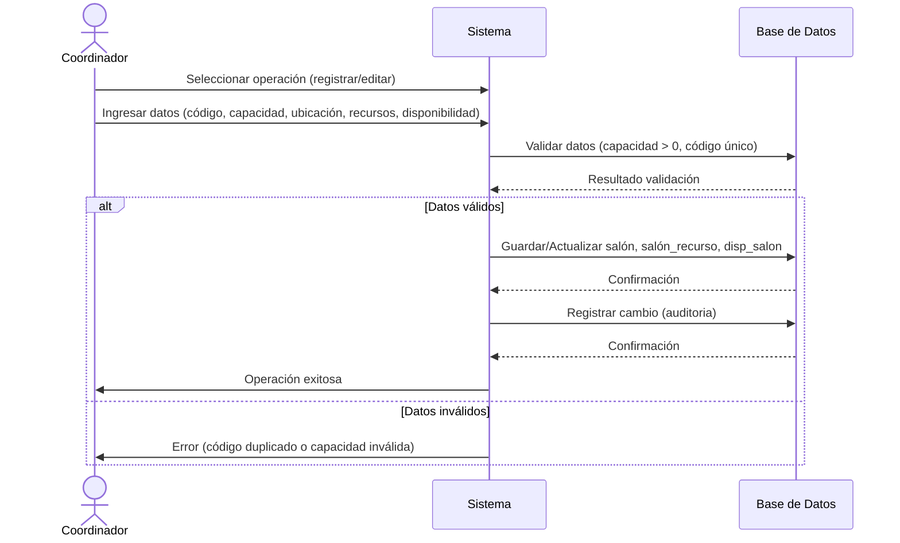

## Caso de Uso: Gestionar Profesores (HU7, HU8)
secuencia_gestionar_profesores.mmdmermaid

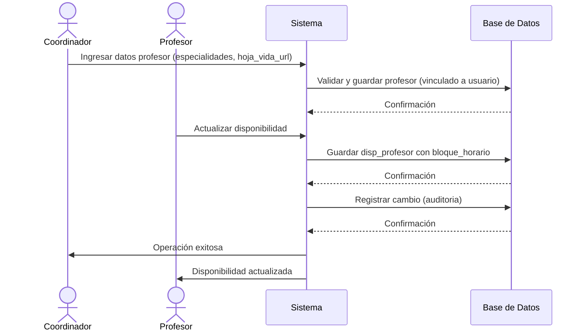

## Caso de Uso: Ejecutar Asignación Automática (HU9, HU10)
secuencia_asignacion_automatica.mmdmermaid

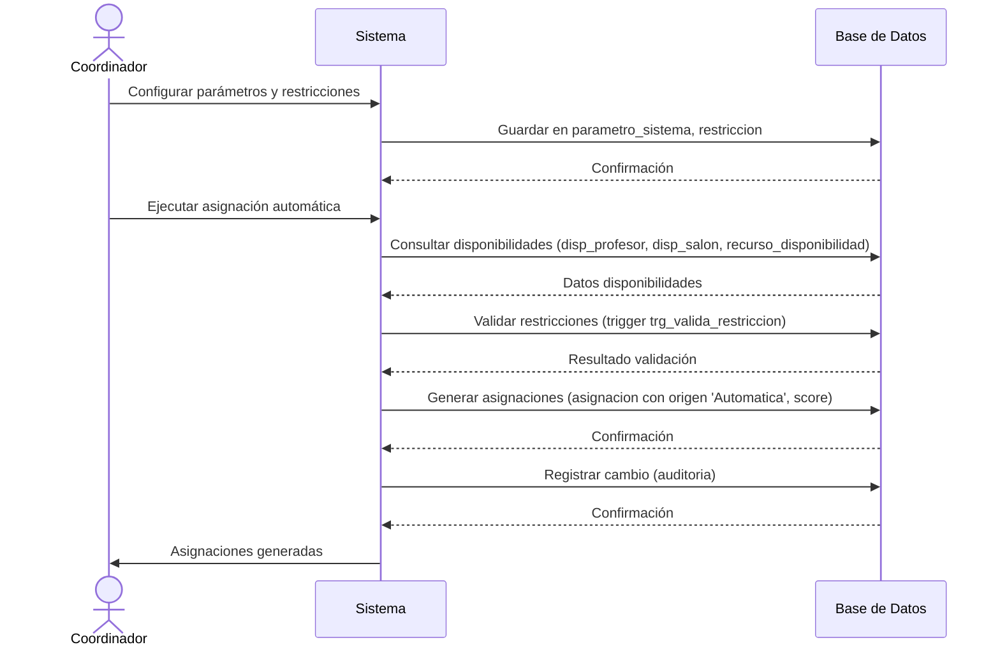

## Caso de Uso: Realizar Asignación Manual (HU11, HU12)
secuencia_asignacion_manual.mmdmermaid

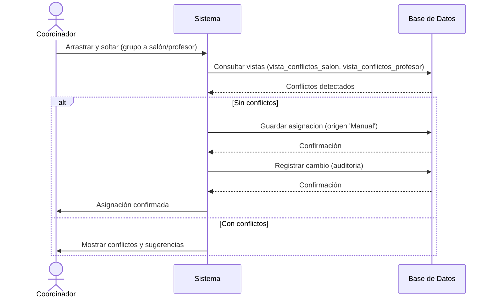

## Caso de Uso: Visualizar Horarios (HU13, HU14)
secuencia_visualizar_horarios.mmdmermaid

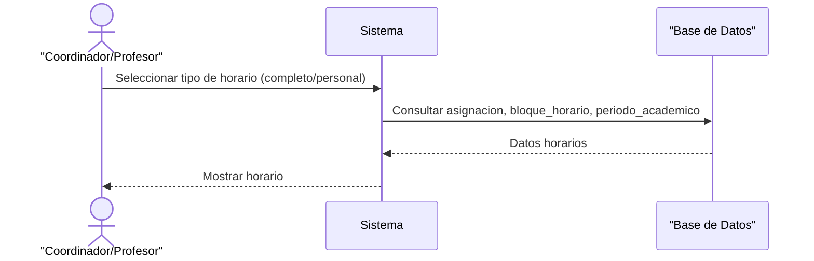

## Caso de Uso: Generar Reportes (HU15)
secuencia_generar_reportes.mmdmermaid

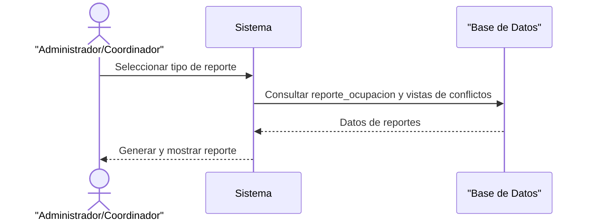

## Caso de Uso: Gestionar Conflictos (HU16, HU17)
secuencia_gestionar_conflictos.mmdmermaid

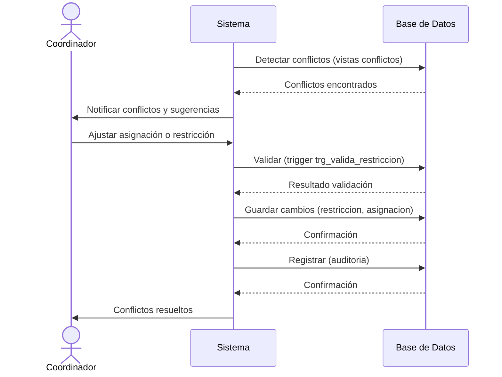

## Caso de Uso: Visualizar Historial (HU18)
secuencia_visualizar_historial.mmdmermaid

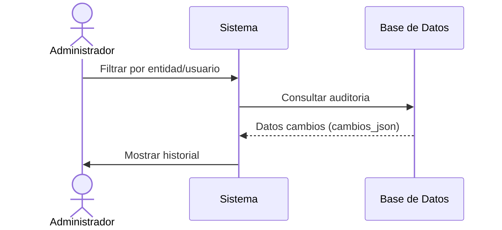

## Caso de Uso: Configurar Sistema (HU19)
secuencia_configurar_sistema.mmdmermaid

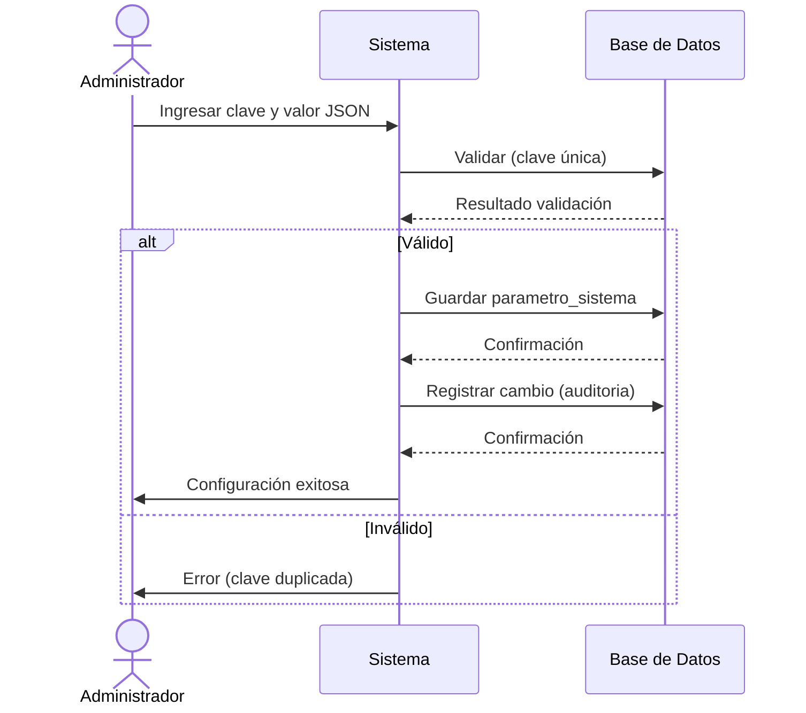
---
---
# Diagrama de Clases

```mermaid
classDiagram
    class PeriodoAcademico {
        -CHAR(36) id PK
        -VARCHAR(120) nombre NOT_NULL
        -DATE fecha_inicio NOT_NULL
        -DATE fecha_fin NOT_NULL
        -TINYINT(1) activo NOT_NULL
        +getNombre() VARCHAR
        +setNombre(nombre: VARCHAR)
        +esActivo() BOOLEAN
    }

    class BloqueHorario {
        -CHAR(36) id PK
        -ENUM dia_semana NOT_NULL
        -TIME hora_inicio NOT_NULL
        -TIME hora_fin NOT_NULL
        +getDiaSemana() ENUM
        +setHoraInicio(hora: TIME)
        +validarDuracion() BOOLEAN
    }

    class Usuario {
        -CHAR(36) id PK
        -VARCHAR(120) nombre NOT_NULL
        -VARCHAR(160) email NOT_NULL UK
        -VARCHAR(255) password_hash NOT_NULL
        -ENUM rol NOT_NULL
        -TINYINT(1) activo NOT_NULL
        -DATETIME created_at NOT_NULL
        -DATETIME updated_at NOT_NULL
        +autenticar(email: VARCHAR, password: VARCHAR) BOOLEAN
        +getRol() ENUM
        +setPassword(password: VARCHAR)
    }

    class Profesor {
        -CHAR(36) id PK
        -CHAR(36) usuario_id FK NOT_NULL UK
        -TEXT especialidades
        -VARCHAR(255) hoja_vida_url
        +getEspecialidades() TEXT
        +setHojaVidaUrl(url: VARCHAR)
    }

    class Grupo {
        -CHAR(36) id PK
        -VARCHAR(120) nombre NOT_NULL
        -VARCHAR(60) nivel NOT_NULL
        -INT num_estudiantes NOT_NULL
        -TEXT caracteristicas
        -TINYINT(1) activo NOT_NULL
        +getNumEstudiantes() INT
        +setCaracteristicas(caracteristicas: TEXT)
    }

    class Salon {
        -CHAR(36) id PK
        -VARCHAR(60) codigo NOT_NULL UK
        -INT capacidad NOT_NULL
        -VARCHAR(160) ubicacion NOT_NULL
        -TINYINT(1) activo NOT_NULL
        +getCapacidad() INT
        +setUbicacion(ubicacion: VARCHAR)
    }

    class Recurso {
        -CHAR(36) id PK
        -VARCHAR(100) nombre NOT_NULL
        -VARCHAR(255) descripcion
        +getNombre() VARCHAR
        +setDescripcion(descripcion: VARCHAR)
    }

    class SalonRecurso {
        -CHAR(36) salon_id PK FK NOT_NULL
        -CHAR(36) recurso_id PK FK NOT_NULL
        -INT cantidad NOT_NULL
        +getCantidad() INT
        +setCantidad(cantidad: INT)
    }

    class RecursoDisponibilidad {
        -CHAR(36) recurso_id PK FK NOT_NULL
        -CHAR(36) bloque_id PK FK NOT_NULL
        -ENUM estado NOT_NULL
        +getEstado() ENUM
        +setEstado(estado: ENUM)
    }

    class DispProfesor {
        -CHAR(36) profesor_id PK FK NOT_NULL
        -CHAR(36) bloque_id PK FK NOT_NULL
        -ENUM estado NOT_NULL
        +getEstado() ENUM
        +setEstado(estado: ENUM)
    }

    class DispSalon {
        -CHAR(36) salon_id PK FK NOT_NULL
        -CHAR(36) bloque_id PK FK NOT_NULL
        -ENUM estado NOT_NULL
        +getEstado() ENUM
        +setEstado(estado: ENUM)
    }

    class Asignacion {
        -CHAR(36) id PK
        -CHAR(36) grupo_id FK NOT_NULL
        -CHAR(36) salon_id FK NOT_NULL
        -CHAR(36) profesor_id FK NOT_NULL
        -CHAR(36) bloque_id FK NOT_NULL
        -CHAR(36) periodo_id FK NOT_NULL
        -ENUM estado NOT_NULL
        -ENUM origen NOT_NULL
        -FLOAT score
        -CHAR(36) created_by FK NOT_NULL
        -DATETIME created_at NOT_NULL
        +asignarProfesor(profesor_id: CHAR) BOOLEAN
        +confirmarAsignacion() BOOLEAN
        +calcularScore() FLOAT
    }

    class TipoRestriccion {
        -CHAR(36) id PK
        -VARCHAR(80) nombre NOT_NULL UK
        -TEXT descripcion
        -JSON regla_default_json
        +getReglaDefault() JSON
        +setDescripcion(descripcion: TEXT)
    }

    class Restriccion {
        -CHAR(36) id PK
        -VARCHAR(80) tipo NOT_NULL
        -VARCHAR(80) objetivo_type NOT_NULL
        -CHAR(36) objetivo_id NOT_NULL
        -JSON regla_json NOT_NULL
        -ENUM dureza NOT_NULL
        +validarRestriccion() BOOLEAN
        +getRegla() JSON
    }

    class Auditoria {
        -CHAR(36) id PK
        -CHAR(36) usuario_id FK NOT_NULL
        -VARCHAR(80) entidad NOT_NULL
        -CHAR(36) entidad_id NOT_NULL
        -VARCHAR(40) accion NOT_NULL
        -JSON cambios_json NOT_NULL
        -VARCHAR(255) motivo
        -DATETIME created_at NOT_NULL
        +registrarCambio(accion: VARCHAR, motivo: VARCHAR) BOOLEAN
        +getCambios() JSON
    }

    class ReporteOcupacion {
        -CHAR(36) id PK
        -CHAR(36) periodo_id FK NOT_NULL
        -ENUM tipo NOT_NULL
        -CHAR(36) objetivo_id NOT_NULL
        -FLOAT ocupacion_porcentaje NOT_NULL
        -INT num_bloques_ocupados NOT_NULL
        -DATETIME created_at NOT_NULL
        +calcularOcupacion() FLOAT
        +getNumBloques() INT
    }

    class ParametroSistema {
        -CHAR(36) id PK
        -VARCHAR(120) clave NOT_NULL UK
        -JSON valor NOT_NULL
        -VARCHAR(60) scope
        +getValor() JSON
        +setValor(valor: JSON)
    }

    %% Relaciones basadas en claves foráneas
    Usuario "1" -- "1" Profesor : fk_profesor_usuario
    Usuario "1" -- "0..*" Asignacion : fk_as_created_by
    Usuario "1" -- "0..*" Auditoria : fk_aud_usuario

    Profesor "1" -- "0..*" DispProfesor : fk_dp_profesor
    Profesor "1" -- "0..*" Asignacion : fk_as_prof

    Grupo "1" -- "0..*" Asignacion : fk_as_grupo

    Salon "1" -- "0..*" SalonRecurso : fk_sr_salon
    Salon "1" -- "0..*" DispSalon : fk_ds_salon
    Salon "1" -- "0..*" Asignacion : fk_as_salon

    Recurso "1" -- "0..*" SalonRecurso : fk_sr_recurso
    Recurso "1" -- "0..*" RecursoDisponibilidad : fk_rd_recurso

    BloqueHorario "1" -- "0..*" DispProfesor : fk_dp_bloque
    BloqueHorario "1" -- "0..*" DispSalon : fk_ds_bloque
    BloqueHorario "1" -- "0..*" RecursoDisponibilidad : fk_rd_bloque
    BloqueHorario "1" -- "0..*" Asignacion : fk_as_bloque

    PeriodoAcademico "1" -- "0..*" Asignacion : fk_as_periodo
    PeriodoAcademico "1" -- "0..*" ReporteOcupacion : fk_ro_periodo

    %% Relaciones muchos a muchos implícitas
    Salon "0..*" -- "0..*" Recurso : via SalonRecurso
    Profesor "0..*" -- "0..*" BloqueHorario : via DispProfesor
    Salon "0..*" -- "0..*" BloqueHorario : via DispSalon
    Recurso "0..*" -- "0..*" BloqueHorario : via RecursoDisponibilidad

    %% Notas sobre valores por defecto, ENUMs, particiones, triggers y vistas
    note "PeriodoAcademico.activo: DEFAULT 1"
    note "Usuario.activo: DEFAULT 1"
    note "Usuario.rol: ENUM values: ADMIN, COORDINADOR, PROFESOR, coord_INFRA"
    note "Grupo.activo: DEFAULT 1"
    note "Salon.activo: DEFAULT 1"
    note "Asignacion.estado: DEFAULT Propuesta"
    note "Asignacion.estado: ENUM values: Propuesta, Confirmada, Anulada"
    note "Asignacion.origen: ENUM values: Manual, Automatica"
    note "Asignacion: PARTITION BY HASH(periodo_id) PARTITIONS 4"
    note "BloqueHorario.dia_semana: ENUM values: Lunes, Martes, Miercoles, Jueves, Viernes, Sabado, Domingo"
    note "RecursoDisponibilidad.estado: ENUM values: Disponible, NoDisponible, Reservado"
    note "DispProfesor.estado: ENUM values: Disponible, NoDisponible, Preferido, Licencia"
    note "DispSalon.estado: ENUM values: Disponible, NoDisponible, Reservado, Mantenimiento"
    note "Restriccion.dureza: ENUM values: Blando, Duro"
    note "Restriccion: TRIGGER trg_valida_restriccion valida objetivo_id contra objetivo_type"
    note "ReporteOcupacion.tipo: ENUM values: Salon, Profesor"
    note "ParametroSistema: Claves esperadas: periodo_academico, horas_laborables, dias_laborables"
    note "Vistas: vista_conflictos_salon, vista_conflictos_profesor para detectar conflictos"
    note "Constraints: CHECK (Grupo.num_estudiantes > 0), CHECK (Salon.capacidad > 0), CHECK (SalonRecurso.cantidad >= 0), CHECK (BloqueHorario.hora_fin > hora_inicio)"
    note "Indices: idx_as_horario_salon (periodo_id, bloque_id, salon_id), idx_as_horario_prof (periodo_id, bloque_id, profesor_id), idx_as_conflictos (periodo_id, bloque_id, salon_id, profesor_id), idx_restriccion_objetivo (objetivo_type, objetivo_id), idx_aud_entidad (entidad, entidad_id)"
    note "Unique Constraints: usuario.email, profesor.usuario_id, salon.codigo, tipo_restriccion.nombre, parametro_sistema.clave, asignacion(grupo_id, bloque_id, periodo_id), reporte_ocupacion(periodo_id, tipo, objetivo_id)"
```
### Enfoque para el Diagrama de Clases

Clases: Cada tabla del modelo físico (periodo_academico, usuario, profesor, etc.) se representa como una clase en el diagrama de clases. Los nombres de las clases coincidirán con los nombres de las tablas para mantener consistencia.
Atributos: Los atributos de cada clase corresponden a las columnas de las tablas, usando tipos de datos específicos del modelo físico (e.g., CHAR(36), VARCHAR(120), TINYINT(1)) y marcando restricciones como NOT_NULL, PK, FK, UK, y CHECK en comentarios cuando sea necesario, ya que Mermaid no soporta estas anotaciones directamente en la sintaxis de clases.
Métodos: Incluiré métodos básicos para cada clase, como constructores, getters, setters, y operaciones específicas derivadas de las épicas (e.g., asignarProfesor() en asignacion, validarRestriccion() en restriccion). Los métodos reflejarán las funcionalidades de las historias de usuario (HU1-HU19), como autenticación, asignación automática/manual, y generación de reportes.
Relaciones:

Asociaciones: Basadas en las claves foráneas del modelo físico (e.g., usuario ||--|| profesor como asociación 1:1, grupo ||--o{ asignacion como 1:n).
Tablas de unión: Representadas como clases con asociaciones muchos a muchos (e.g., salon_recurso como clase con relaciones a salon y recurso).
Cardinalidades: Usaré 1--1, 1--0..*, y 0..*--0..* para reflejar las relaciones uno a uno, uno a muchos, y muchos a muchos, respectivamente.

Notas: Los valores de ENUM, valores por defecto, índices, particiones, triggers (trg_valida_restriccion), y vistas (vista_conflictos_salon, vista_conflictos_profesor) se documentarán en notas (note), ya que no se representan directamente en un diagrama de clases.
Cumplimiento: El diagrama soportará todas las épicas (HU1-HU19), historias técnicas (TH1-TH4), y criterios de aceptación (rendimiento, seguridad, compatibilidad, mantenibilidad) del documento.

---
---
# Diagrama Flujo de Datos

```mermaid
graph TD
    %% Entidades Externas
    A[Administrador]:::external
    B[Coordinador]:::external
    C[Profesor]:::external
    D[Sistema Externo]:::external

    %% Almacenes de Datos (basados en tablas del modelo físico)
    D1[(Usuario)]:::store
    D2[(Profesor)]:::store
    D3[(PeriodoAcademico)]:::store
    D4[(Grupo)]:::store
    D5[(Salon)]:::store
    D6[(Recurso)]:::store
    D7[(SalonRecurso)]:::store
    D8[(BloqueHorario)]:::store
    D9[(DispProfesor)]:::store
    D10[(DispSalon)]:::store
    D11[(RecursoDisponibilidad)]:::store
    D12[(Asignacion)]:::store
    D13[(TipoRestriccion)]:::store
    D14[(Restriccion)]:::store
    D15[(Auditoria)]:::store
    D16[(ReporteOcupacion)]:::store
    D17[(ParametroSistema)]:::store
    D18[(VistaConflictosSalon)]:::store
    D19[(VistaConflictosProfesor)]:::store

    %% Procesos Principales
    P1(Gestionar Usuarios):::process
    P2(Gestionar Recursos Académicos):::process
    P3(Gestionar Asignaciones):::process
    P4(Generar Reportes):::process
    P5(Configurar Sistema):::process

    %% Flujos de Datos
    %% Administrador
    A --> |Credenciales| P1
    A --> |Parámetros| P5
    A --> |Solicitar Auditoría| P4
    P1 --> |Usuario Creado/Actualizado| D1
    P1 --> |Registro Auditoría| D15
    P5 --> |Parámetros Configurados| D17
    P4 --> |Reporte Auditoría| A
    D1 --> |Datos Usuario| P1
    D15 --> |Datos Auditoría| P4
    D17 --> |Parámetros| P5

    %% Coordinador
    B --> |Configurar Periodo| P2
    B --> |Configurar Grupo| P2
    B --> |Configurar Salón| P2
    B --> |Configurar Profesor| P2
    B --> |Configurar Restricciones| P3
    B --> |Asignación Manual| P3
    B --> |Solicitar Reportes| P4
    P2 --> |Periodo Creado/Actualizado| D3
    P2 --> |Grupo Creado/Actualizado| D4
    P2 --> |Salón Creado/Actualizado| D5
    P2 --> |Recurso Creado/Actualizado| D6
    P2 --> |Profesor Creado/Actualizado| D2
    P2 --> |Salón-Recurso Asignado| D7
    P2 --> |Disponibilidad Salón| D10
    P2 --> |Bloque Horario Creado| D8
    P3 --> |Restricción Creada| D14
    P3 --> |Asignación Propuesta/Confirmada| D12
    P3 --> |Registro Auditoría| D15
    P4 --> |Reporte Ocupación| B
    P4 --> |Reporte Conflictos| B
    D3 --> |Datos Periodo| P2
    D4 --> |Datos Grupo| P2
    D5 --> |Datos Salón| P2
    D6 --> |Datos Recurso| P2
    D7 --> |Salón-Recurso| P2
    D8 --> |Bloques Horarios| P2
    D10 --> |Disponibilidad Salón| P2
    D2 --> |Datos Profesor| P2
    D12 --> |Asignaciones| P3
    D14 --> |Restricciones| P3
    D15 --> |Datos Auditoría| P4
    D16 --> |Datos Ocupación| P4
    D18 --> |Conflictos Salón| P4
    D19 --> |Conflictos Profesor| P4

    %% Profesor
    C --> |Disponibilidad| P2
    C --> |Consultar Asignaciones| P3
    P2 --> |Disponibilidad Profesor| D9
    P3 --> |Asignaciones| C
    D9 --> |Disponibilidad Profesor| P2
    D12 --> |Asignaciones| P3

    %% Sistema Externo
    D --> |Solicitar Reportes| P4
    P4 --> |Reporte Ocupación| D
    P4 --> |Reporte Conflictos| D
    D16 --> |Datos Ocupación| P4
    D18 --> |Conflictos Salón| P4
    D19 --> |Conflictos Profesor| P4

    %% Proceso de Asignaciones (Usa múltiples almacenes)
    P3 --> |Disponibilidad Recurso| D11
    D8 --> |Bloques Horarios| P3
    D9 --> |Disponibilidad Profesor| P3
    D10 --> |Disponibilidad Salón| P3
    D11 --> |Disponibilidad Recurso| P3
    D13 --> |Tipos Restricción| P3

    %% Estilos
    classDef external fill:#f9f,stroke:#333,stroke-width:2px
    classDef process fill:#bbf,stroke:#333,stroke-width:2px,shape:circle
    classDef store fill:#dfd,stroke:#333,stroke-width:2px
```
## Enfoque para el Diagrama de Flujo de Datos

Un DFD muestra cómo los datos fluyen entre entidades externas, procesos, almacenes de datos, y flujos de datos. Basado en el sistema descrito en el documento, el DFD nivel 0 (diagrama de contexto) y nivel 1 (desglose de procesos principales) cubrirán las funcionalidades clave del sistema de gestión de asignaciones académicas. A continuación, detallo el enfoque:

### Entidades Externas:
Administrador: Gestiona usuarios, parámetros del sistema, y auditorías (HU1, HU2, HU19).
Coordinador: Configura periodos académicos, grupos, salones, y restricciones; realiza asignaciones manuales (HU3-HU6, HU9-HU12, HU16-HU17).
Profesor: Registra disponibilidades y consulta asignaciones (HU7-HU8, HU11).
Sistema Externo: Genera reportes de ocupación y detecta conflictos (HU13-HU15).

### Procesos Principales (basados en épicas):
Gestión de Usuarios: Autenticación y gestión de roles (HU1-HU2).
Gestión de Recursos Académicos: Configuración de periodos, grupos, salones, y profesores (HU3-HU8).
Gestión de Asignaciones: Asignaciones automáticas y manuales, validación de restricciones (HU9-HU12, HU16-HU17).
Generación de Reportes: Reportes de ocupación y auditorías (HU13-HU15, HU18).
Configuración del Sistema: Gestión de parámetros del sistema (HU19).

### Almacenes de Datos:
Cada tabla del modelo físico (periodo_academico, usuario, profesor, grupo, salon, recurso, salon_recurso, recurso_disponibilidad, disp_profesor, disp_salon, asignacion, tipo_restriccion, restriccion, auditoria, reporte_ocupacion, parametro_sistema) se representa como un almacén de datos.
Las vistas (vista_conflictos_salon, vista_conflictos_profesor) se incluirán como almacenes derivados para reportes de conflictos.

### Flujos de Datos:
Representan la información que se mueve entre entidades externas, procesos, y almacenes (e.g., credenciales de usuario, asignaciones propuestas, reportes de ocupación).
Basados en las interacciones descritas en las épicas (e.g., HU1: autenticación envía credenciales, HU9: asignación automática genera horarios).

### Mermaid Sintaxis:
Usaré la sintaxis de Mermaid para diagramas de flujo (graph TD), ya que Mermaid no tiene una sintaxis específica para DFD, pero los diagramas de flujo pueden adaptarse.
Entidades externas: Representadas como nodos rectangulares ([Entidad]).
Procesos: Representados como círculos ((Proceso)).
Almacenes de datos: Representados como nodos con líneas laterales abiertas ((Almacen)) para indicar almacenamiento.
Flujos de datos: Representados como flechas con etiquetas (--> |etiqueta|).

### Cumplimiento:
El DFD reflejará las funcionalidades descritas en las épicas (HU1-HU19) y soportará las historias técnicas (TH1-TH4).
Cumplirá los criterios de aceptación: rendimiento (< 2 segundos, soportado por índices y particiones), seguridad (autenticación, auditoría), compatibilidad (API RESTful), y mantenibilidad (diseño modular).

---
---
# Diagrama Entidad Relación

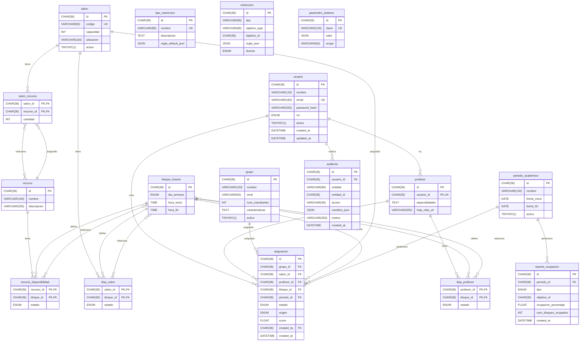
## Enfoque para el Diagrama Entidad Relación
El código fuente en Mermaid para el diagrama de entidad-relación (ERD) correspondiente al esquema de la base de datos actualizada, que cumple al 100% con los requerimientos del documento "Proyectos Desarrollo de Software 2.docx". El diagrama incluye todas las tablas, sus atributos, claves primarias, claves foráneas, y relaciones, siguiendo la estructura proporcionada en el esquema SQL. He organizado el diagrama para que sea claro, visualmente comprensible, y refleje las entidades, sus relaciones, y las cardinalidades adecuadas.
Explicación del Enfoque

Tablas y Atributos: Cada tabla del esquema SQL se representa como una entidad en Mermaid, con sus atributos listados. Las claves primarias están marcadas con (PK) y las claves foráneas con (FK).
Relaciones: Las relaciones se derivan de las claves foráneas (FOREIGN KEY) y las tablas de unión (e.g., salon_recurso, disp_profesor). Las cardinalidades reflejan las restricciones de integridad (e.g., uno a muchos, muchos a muchos).
Optimización Visual: He agrupado las entidades lógicamente y usado nombres claros para facilitar la lectura. Las relaciones están definidas con cardinalidades explícitas (e.g., 1..1, 0..*) basadas en los requerimientos.
Mermaid: El código se genera en la sintaxis de Mermaid para diagramas ER, que es compatible con herramientas como Mermaid Live Editor o integraciones en markdown.
---
---
# Diagrama Modelo Relacional

```mermaid
erDiagram
    periodo_academico {
        string id PK
        string nombre
        date   fecha_inicio
        date   fecha_fin
        boolean activo
    }

    bloque_horario {
        string id PK
        string dia_semana "Lunes|Martes|Miercoles|Jueves|Viernes|Sabado|Domingo"
        time   hora_inicio
        time   hora_fin
        string chk_bloque_duracion "Regla: hora_fin > hora_inicio"
    }

    usuario {
        string   id PK
        string   nombre
        string   email UK
        string   password_hash
        string   rol "ADMIN|COORDINADOR|PROFESOR|coord_INFRA"
        boolean  activo
        datetime created_at
        datetime updated_at
    }

    profesor {
        string id PK
        string usuario_id FK "usuario.id (UNIQUE → relación 1:1)"
        string especialidades
        string hoja_vida_url
    }

    grupo {
        string id PK
        string nombre
        string nivel
        int    num_estudiantes "> 0"
        string caracteristicas
        boolean activo
    }

    salon {
        string id PK
        string codigo UK
        int    capacidad "> 0"
        string ubicacion
        boolean activo
    }

    recurso {
        string id PK
        string nombre
        string descripcion
    }

    salon_recurso {
        string salon_id   PK "FK salon.id"
        string recurso_id PK "FK recurso.id"
        int    cantidad ">= 0"
    }

    recurso_disponibilidad {
        string recurso_id PK "FK recurso.id"
        string bloque_id  PK "FK bloque_horario.id"
        string estado "Disponible|NoDisponible|Reservado"
    }

    disp_profesor {
        string profesor_id PK "FK profesor.id"
        string bloque_id   PK "FK bloque_horario.id"
        string estado "Disponible|NoDisponible|Preferido|Licencia"
    }

    disp_salon {
        string salon_id  PK "FK salon.id"
        string bloque_id PK "FK bloque_horario.id"
        string estado "Disponible|NoDisponible|Reservado|Mantenimiento"
    }

    asignacion {
        string   id PK
        string   grupo_id    FK "grupo.id"
        string   salon_id    FK "salon.id"
        string   profesor_id FK "profesor.id"
        string   bloque_id   FK "bloque_horario.id"
        string   periodo_id  FK "periodo_academico.id"
        string   estado "Propuesta|Confirmada|Anulada"
        string   origen "Manual|Automatica"
        float    score
        string   created_by  FK "usuario.id"
        datetime created_at
        string   uq_as_unique "UNIQUE (grupo_id,bloque_id,periodo_id)"
        string   idx_as_horario_salon "INDEX (periodo_id,bloque_id,salon_id)"
        string   idx_as_horario_prof  "INDEX (periodo_id,bloque_id,profesor_id)"
        string   idx_as_conflictos    "INDEX (periodo_id,bloque_id,salon_id,profesor_id)"
    }

    tipo_restriccion {
        string id PK
        string nombre UK
        string descripcion
        string regla_default_json "JSON"
    }

    restriccion {
        string id PK
        string tipo
        string objetivo_type
        string objetivo_id
        string regla_json "JSON"
        string dureza "Blando|Duro"
        string idx_restriccion_objetivo "INDEX (objetivo_type,objetivo_id)"
        string nota_trigger "Trigger: valida objetivo_id según objetivo_type"
    }

    auditoria {
        string   id PK
        string   usuario_id FK "usuario.id"
        string   entidad
        string   entidad_id
        string   accion
        string   cambios_json "JSON"
        string   motivo
        datetime created_at
        string   idx_aud_entidad "INDEX (entidad,entidad_id)"
    }

    reporte_ocupacion {
        string   id PK
        string   periodo_id FK "periodo_academico.id"
        string   tipo "Salon|Profesor"
        string   objetivo_id
        float    ocupacion_porcentaje
        int      num_bloques_ocupados
        datetime created_at
        string   uq_ro_unique "UNIQUE (periodo_id,tipo,objetivo_id)"
    }

    parametro_sistema {
        string id PK
        string clave UK
        string valor "JSON"
        string scope
        string comentario "Claves: periodo_academico|horas_laborables|dias_laborables"
    }

    %% Relaciones (cardinalidades)
    usuario ||--|| profesor : fk_profesor_usuario
    usuario ||--o{ asignacion : fk_as_created_by
    usuario ||--o{ auditoria  : fk_aud_usuario

    profesor ||--o{ disp_profesor : fk_dp_profesor
    profesor ||--o{ asignacion    : fk_as_prof

    grupo   ||--o{ asignacion : fk_as_grupo

    salon   ||--o{ salon_recurso : fk_sr_salon
    salon   ||--o{ disp_salon    : fk_ds_salon
    salon   ||--o{ asignacion    : fk_as_salon

    recurso ||--o{ salon_recurso         : fk_sr_recurso
    recurso ||--o{ recurso_disponibilidad : fk_rd_recurso

    bloque_horario ||--o{ disp_profesor          : fk_dp_bloque
    bloque_horario ||--o{ disp_salon             : fk_ds_bloque
    bloque_horario ||--o{ recurso_disponibilidad : fk_rd_bloque
    bloque_horario ||--o{ asignacion             : fk_as_bloque

    periodo_academico ||--o{ asignacion       : fk_as_periodo
    periodo_academico ||--o{ reporte_ocupacion : fk_ro_periodo
```
## Enfoque para el Diagrama Modelo Relacional
El código fuente en Mermaid para el Modelo Relacional correspondiente al esquema de la base de datos actualizada, que cumple al 100% con los requerimientos del documento "Proyectos Desarrollo de Software 2.docx". Este modelo relacional refleja las tablas, sus atributos, tipos de datos, restricciones (claves primarias, foráneas, únicas, y de verificación), y las relaciones entre ellas, basándose en el esquema SQL proporcionado. El diagrama está diseñado para ser claro, preciso y alineado con los requisitos de la primera entrega del proyecto (clase 9), específicamente el Modelo Relacional.
### Explicación del Enfoque

- **Tablas y Atributos:** Cada tabla se representa con sus columnas, incluyendo tipos de datos y restricciones como claves primarias (PK), claves foráneas (FK), claves únicas (UK), y verificaciones (CHECK). Los tipos de datos se mantienen fieles al esquema SQL (e.g., CHAR(36), VARCHAR, ENUM, etc.).
- **Relaciones:** Las claves foráneas definen las relaciones entre tablas, representadas con líneas que indican cardinalidades (e.g., uno a muchos, muchos a muchos). Las tablas de unión (e.g., salon_recurso, disp_profesor) se incluyen explícitamente como relaciones muchos a muchos.
- **Restricciones:** Se destacan las restricciones de integridad (FOREIGN KEY, UNIQUE, CHECK) en los atributos y relaciones. Los triggers (e.g., trg_valida_restriccion) no se representan gráficamente, pero se mencionan en comentarios para contexto.
- **Mermaid:** Uso la sintaxis de Mermaid para diagramas ER, adaptada para enfatizar el modelo relacional, incluyendo tipos de datos y restricciones. Esto es compatible con herramientas como Mermaid Live Editor.
- **Organización:** Las tablas están agrupadas lógicamente para reflejar las épicas (gestión de usuarios, grupos, salones, asignaciones, etc.), y las relaciones se dibujan para minimizar cruces y mejorar la legibilidad.
---
---
# Diagrama Modelo Fisico

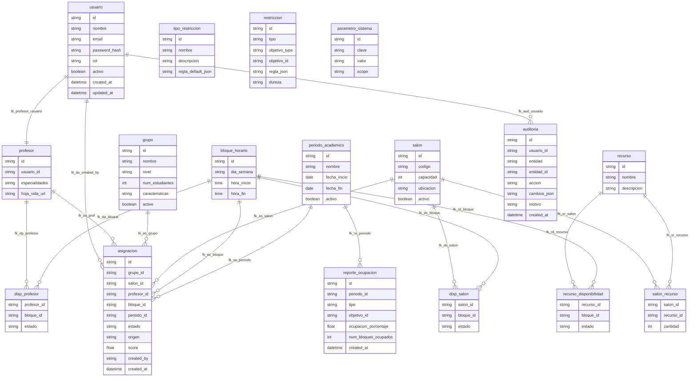
## Enfoque para el Diagrama Modelo Fisico
El código fuente en Mermaid para el Diagrama Modelo Físico de la base de datos, basado en el esquema SQL que cumple al 100% con los requerimientos del documento "Proyectos Desarrollo de Software 2.docx". El modelo físico representa la implementación específica de la base de datos en MySQL, incluyendo tipos de datos exactos (e.g., CHAR(36), VARCHAR(120), TINYINT(1)), restricciones (PRIMARY KEY, FOREIGN KEY, UNIQUE, CHECK, NOT NULL), índices, particiones, triggers, y vistas, manteniendo la fidelidad al esquema original. Este diagrama se alinea con los requisitos de la primera entrega (clase 9) del proyecto, específicamente el Modelo Físico.
## Explicación del Enfoque

Tablas y Atributos: Cada tabla se representa con sus columnas, tipos de datos exactos (como CHAR(36) para UUIDs, TINYINT(1) para booleanos), y restricciones (NOT NULL, PRIMARY KEY, FOREIGN KEY, UNIQUE, CHECK) según el esquema SQL.
- **Índices:** Los índices explícitos (e.g., idx_as_horario_salon, idx_as_conflictos) se incluyen como anotaciones en las tablas correspondientes.
- **Particiones:** La partición por periodo_id en la tabla asignacion se documenta en una nota, ya que Mermaid no representa particiones directamente.
- **Triggers y Vistas:** El trigger trg_valida_restriccion y las vistas vista_conflictos_salon y vista_conflictos_profesor se mencionan en notas, ya que Mermaid no permite representarlos gráficamente en diagramas ER.
- **Relaciones:** Las relaciones se derivan de las claves foráneas (FOREIGN KEY), con cardinalidades uno a muchos (||--o{) y muchos a muchos (}o--o{) para tablas de unión (e.g., salon_recurso).
- **Mermaid Sintaxis:** Uso la sintaxis de Mermaid para diagramas ER, adaptada para reflejar un modelo físico con tipos de datos específicos y restricciones detalladas. Los valores de ENUM y otros detalles se documentan en notas para evitar errores de análisis, como los encontrados previamente.
- **Cumplimiento:** El diagrama refleja el esquema SQL completo, soportando todas las épicas (HU1-HU19), historias técnicas (TH1-TH4), y criterios de aceptación del documento.
---
---

# Descripción General Detallada: Base de Datos

A continuación, presento una **descripción detallada** de cómo el **esquema actualizado de la base de datos** cumple con los requerimientos especificados en el documento **“Proyectos Desarrollo de Software 2.docx”**. El esquema ha sido diseñado para satisfacer **todas las épicas, historias de usuario (HU), historias técnicas (TH), y criterios de aceptación** del **sistema de asignación de salones** para un centro educativo, siguiendo las prácticas de **DevOps, Scrum, Kanban y TDD**, con un enfoque en **mantenibilidad, modularidad, cohesión y bajo acoplamiento**. También se han incorporado mejoras para **optimizar eficiencia, escalabilidad y robustez**, alineándose con las entregas del proyecto y los criterios generales.

---

## 1. Cumplimiento de los Objetivos Generales del Documento

El documento establece que el sistema debe integrar el ciclo completo de **DevOps**, gestionarse con **Scrum** y **Kanban**, e implementar **TDD** (pruebas unitarias y refactoring). Además, se evalúan **mantenibilidad, modularidad, cohesión y bajo acoplamiento**. La base de datos cumple con estos objetivos de la siguiente manera:

### Ciclo DevOps
- La estructura relacional con tablas normalizadas (`usuario`, `profesor`, `grupo`, `salon`, etc.) y la tabla `asignacion` **con particionamiento por `periodo_id`** facilita la integración con herramientas de **integración y despliegue continuo** (p. ej., **GitHub Actions**, mencionadas en la segunda entrega).  
- Los **índices optimizados** (p. ej., `idx_as_horario_salon`, `idx_as_conflictos`) y **vistas** (`vista_conflictos_salon`, `vista_conflictos_profesor`) aseguran un **rendimiento adecuado** para operaciones en tiempo real.  
- La tabla `auditoria` permite **trazabilidad de cambios**, esencial para auditorías en un pipeline DevOps.  
- La tabla `parametro_sistema` soporta **configuraciones dinámicas**, facilitando la adaptación del sistema sin cambios en el código, un principio clave de DevOps.

### Scrum y Kanban
- La base de datos está diseñada para soportar la **gestión del proyecto mediante tableros Kanban** (segunda entrega). Por ejemplo, la tabla `asignacion` con **`estado`** (*Propuesta/Confirmada/Anulada*) y **`origen`** (*Manual/Automática*) permite **rastrear el progreso** de las asignaciones en un tablero Kanban, integrándose con herramientas como **GitHub Issues** o **Projects**.  
- La **estructura modular** (tablas separadas por entidad: `usuario`, `grupo`, `salon`, etc.) permite **iteraciones ágiles**, ya que cada épica puede desarrollarse y probarse de forma independiente.

### TDD (Pruebas Unitarias y Refactoring)
- La **modularidad** de las tablas y las **restricciones de integridad** (`FOREIGN KEY`, `CHECK`, `UNIQUE`) facilitan la creación de **pruebas unitarias** para validar operaciones CRUD y reglas de negocio (p. ej., **capacidad de salones**, **conflictos de horario**).  
- Los **triggers** (p. ej., `trg_valida_restriccion`) y **vistas** aseguran que las **reglas de negocio** se mantengan consistentes, reduciendo la necesidad de **refactoring** complejo en el código de la aplicación.

### Mantenibilidad, Modularidad, Cohesión y Bajo Acoplamiento
- **Mantenibilidad:** Tablas normalizadas (p. ej., `salon_recurso`, `recurso_disponibilidad`) y **nombres de campos claros**, lo que facilita el mantenimiento. La tabla `auditoria` registra cambios, ayudando a **diagnosticar problemas**.  
- **Modularidad:** Cada entidad (`usuarios`, `profesores`, `grupos`, `salones`) tiene su **propia tabla**, lo que permite **desarrollar y modificar módulos** del sistema de forma independiente.  
- **Cohesión:** Cada tabla tiene una **responsabilidad clara** (p. ej., `bloque_horario` para horarios, `restriccion` para reglas), asegurando que las **funciones estén bien definidas**.  
- **Bajo Acoplamiento:** Las relaciones entre tablas usan **claves foráneas**, pero las dependencias están **minimizadas**, permitiendo cambios en una tabla sin afectar ampliamente otras (p. ej., `recurso_disponibilidad` es independiente de `salon`).

---

## 2. Cumplimiento de las Entregas del Proyecto

El documento especifica **dos entregas principales**, con criterios claros para cada una. La base de datos **soporta ambos conjuntos de requisitos**:

### Primera Entrega (Clase 9)

**Análisis, Levantamiento de Requerimientos y Diseño (50%)**
- **Diagrama de Casos de Uso y Casos de Uso:** La base de datos cubre **todas las HU (HU1–HU19)**, desde **autenticación** hasta **reportes**. Por ejemplo, las tablas `usuario` y `profesor` soportan **HU1** y **HU7**, mientras que `asignacion` y `restriccion` soportan **HU9–HU12**.  
- **Diagrama de Clases / Flujo de Datos:** Las tablas reflejan un **diseño orientado a objetos** (p. ej., `Usuario`, `Profesor`, `Grupo`, `Salon` como clases) con **relaciones claras** (`FOREIGN KEY`) que modelan **flujos de datos**, como la asignación de grupos a salones y profesores.  
- **DER, Modelo Relacional y Modelo Físico:** El esquema SQL es el **modelo físico**, derivado de un **modelo relacional normalizado** (3FN en la mayoría de las tablas) y un **modelo entidad-relación** implícito en las tablas y sus relaciones.

**Configuración de la Infraestructura de Desarrollo (50%)**
- **Repositorio GitHub y Estrategia de Branching:** La base de datos no interactúa directamente con GitHub, pero su **diseño modular** permite integrarse con un **repositorio** para almacenar **scripts SQL, triggers y vistas**, soportando **branching** para desarrollo iterativo.  
- **Configuración de la Base de Datos:** El esquema usa **MySQL** con **InnoDB** y **utf8mb4**, con **índices, particiones, triggers y vistas**, cumpliendo con los requisitos de **configuración robusta**.  
- **Entorno de Desarrollo:** La base de datos es **compatible con entornos modernos** (MySQL es ampliamente soportado), y los **comentarios SQL** (p. ej., sobre `password_hash`) guían la **implementación segura**.

### Segunda Entrega (Clase 15)

**Gestión del Proyecto (25%)**  
Las tablas `asignacion` (con `estado` y `origen`) y `auditoria` permiten **rastrear el estado** de las asignaciones y los cambios, integrándose con herramientas como **GitHub Issues**, **Projects** y **Milestones** para **tableros Kanban**.

**Continuous Development (25%)**  
La estructura soporta **integración con GitHub Repository** mediante scripts SQL **versionados**, y las **claves foráneas y restricciones** facilitan **pull requests** al garantizar **datos consistentes**.

**Integración y Despliegue Continuo (25%)**  
La base de datos está **optimizada** para integrarse con **GitHub Actions** (p. ej., para ejecutar **scripts de migración** o **pruebas**). Las **vistas** (`vista_conflictos_salon`, `vista_conflictos_profesor`) y la tabla `reporte_ocupacion` facilitan **pruebas unitarias automatizadas** para validar asignaciones y conflictos.

**Funcionalidad de Módulos Desarrollados (25%)**  
Cada **módulo** (gestión de usuarios, grupos, salones, asignaciones, etc.) está soportado por **tablas específicas**, con **índices y vistas** que aseguran funcionalidad **eficiente**.

---

## 3. Cumplimiento de las Épicas Principales

A continuación, detallo cómo la base de datos soporta cada épica del **backlog de producto**:

### Épica 1: Gestión de Usuarios y Autenticación (HU1, HU2)
- **Tabla `usuario`:** Almacena datos de usuarios (`nombre`, `email`, `password_hash`) y **roles** (`ADMIN`, `COORDINADOR`, `PROFESOR`, `coord_INFRA`), soportando **creación, gestión y autenticación por rol**. Campos `created_at` y `updated_at` habilitan **auditoría**.  
- **Seguridad:** El comentario sobre usar **bcrypt** para `password_hash` asegura **autenticación segura**.

### Épica 2: Gestión de Grupos de Estudiantes (HU3, HU4)
- **Tabla `grupo`:** Incluye `nombre`, `nivel`, `num_estudiantes` y `caracteristicas` para **registrar y gestionar grupos**. El campo `activo` permite **desactivar** grupos sin eliminarlos (**HU4**).

### Épica 3: Gestión de Salones (HU5, HU6)
- **Tabla `salon`:** Almacena `codigo`, `capacidad`, `ubicacion` y `activo` para **registrar salones**.  
- **Tablas `salon_recurso` y `recurso`:** Gestionan **recursos** como proyectores o computadoras.  
- **Tabla `disp_salon`:** Registra **disponibilidad horaria** con estados (*Disponible, NoDisponible, Reservado, Mantenimiento*), cumpliendo **HU6**.  
- **Tabla `recurso_disponibilidad`:** Añade **restricciones horarias** para recursos.

### Épica 4: Gestión de Profesores (HU7, HU8)
- **Tabla `profesor`:** Almacena **especialidades** y `hoja_vida_url`, vinculada a `usuario` por `usuario_id`.  
- **Tabla `disp_profesor`:** Gestiona **disponibilidad horaria** con estados (*Disponible, NoDisponible, Preferido, Licencia*), soportando **asignaciones especiales**.

### Épica 5: Sistema de Asignación Automática (HU9, HU10)
- **Tabla `asignacion`:** Registra asignaciones con `grupo_id`, `salon_id`, `profesor_id`, `bloque_id`, `periodo_id`, `estado`, `origen` y `score`. El campo **`score`** facilita la **evaluación** de asignaciones **automáticas**.  
- **Tablas `restriccion` y `tipo_restriccion`:** Permiten configurar **parámetros y prioridades** (p. ej., **minimizar cambios de salón**) con `regla_json` y reglas predefinidas, soportando **HU10**.

### Épica 6: Sistema de Asignación Manual (HU11, HU12)
- **`asignacion` con `origen = 'Manual'`** soporta **asignaciones manuales**.  
- **Vistas `vista_conflictos_salon` y `vista_conflictos_profesor`:** Detectan **conflictos en tiempo real** (sobrecupos, superposiciones), cumpliendo **HU12**.

### Épica 7: Visualización y Reportes (HU13, HU14, HU15)
- `asignacion` junto con `periodo_academico` y `bloque_horario` permite **visualizar horarios** completos (**HU13**) y **personales** (**HU14**).  
- **Tabla `reporte_ocupacion`:** Proporciona **estadísticas precalculadas** de **utilización** de salones y profesores, optimizando **HU15**.

### Épica 8: Gestión de Conflictos y Restricciones (HU16, HU17)
- **Tabla `restriccion`:** Define **restricciones específicas** con `tipo`, `objetivo_type`, `objetivo_id`, `regla_json` y `dureza`. El **trigger `trg_valida_restriccion`** asegura la validez de `objetivo_id`.  
- **Vistas de conflictos:** `vista_conflictos_salon` y `vista_conflictos_profesor` **notifican conflictos** y pueden **sugerir alternativas** al integrarse con la lógica de la aplicación.

### Épica 9: Historial y Auditoría (HU18)
- **Tabla `auditoria`:** Registra cambios con `usuario_id`, `entidad`, `entidad_id`, `accion`, `cambios_json`, `motivo` y `created_at`, cumpliendo **HU18** al **rastrear quién** realizó cada modificación.

### Épica 10: Configuración del Sistema (HU19)
- **Tabla `parametro_sistema`:** Almacena **configuraciones generales** (`clave`, `valor`, `scope`) como **períodos académicos** o **días laborables**. Los **comentarios SQL** especifican **claves esperadas**, asegurando **consistencia**.

---

## 4. Cumplimiento de las Historias Técnicas

- **TH1: Configurar e implementar la base de datos**  
  El esquema completo con **InnoDB** y **utf8mb4** está implementado, con **tablas normalizadas, índices, particiones, triggers y vistas**, cubriendo **todas las entidades y relaciones** necesarias.

- **TH2: Desarrollar API RESTful**  
  Aunque la API es responsabilidad del backend, la base de datos está diseñada para **soportar operaciones RESTful**. Cada tabla (p. ej., `usuario`, `grupo`, `asignacion`) tiene un **`id` único** y **campos claros**, facilitando endpoints como `/usuarios`, `/grupos`, `/asignaciones`.

- **TH3: Sistema de autenticación y autorización segura**  
  `usuario` con `password_hash` (recomendado **bcrypt**) y `rol` permite **autenticación** y **autorización por roles**. La tabla `auditoria` puede registrar **intentos de acceso** si es necesario.

- **TH4: Interfaz responsive y accesible**  
  La base de datos soporta una **interfaz responsive** al proporcionar **datos estructurados y optimizados** (índices, vistas) para **consultas rápidas**, compatibles con **navegadores modernos**.

---

## 5. Cumplimiento de los Criterios de Aceptación General

- **Intuitivo y mínima capacitación:** La estructura **clara y modular** (tablas específicas por entidad) permite una **interfaz intuitiva**, ya que los **datos están organizados lógicamente**.  
- **Respuesta en menos de 2 segundos:** Los **índices** (p. ej., `idx_as_horario_salon`, `idx_as_conflictos`) y **vistas** (`vista_conflictos_salon`) **optimizan consultas críticas**, asegurando un **rendimiento adecuado**.  
- **Compatibilidad con navegadores modernos:** La base de datos es **independiente del frontend**, pero su **diseño relacional** y uso de **MySQL** (ampliamente soportado) garantiza **compatibilidad** con aplicaciones web modernas.  
- **Seguridad y respaldo de datos:** El uso de **`password_hash`**, **triggers** para **validaciones**, y `auditoria` asegura la **seguridad**. La estructura **InnoDB** soporta **transacciones** y **respaldos regulares**.

---

## 6. Priorización Inicial

El documento prioriza las épicas en cuatro grupos. La base de datos las **soporta completamente**:

- **Épicas 1, 2, 3, 4 (Gestión básica):** Tablas `usuario`, `grupo`, `salon`, `profesor`, `salon_recurso`, `disp_salon`, `disp_profesor` y `recurso_disponibilidad` cubren la **gestión de usuarios y recursos**.  
- **Épicas 10, 6 (Configuración y asignación manual):** `parametro_sistema` y `asignacion` (con `origen='Manual'`) junto con **vistas de conflictos** soportan estas funcionalidades.  
- **Épica 5 (Asignación automática):** `asignacion` (con `score`), `restriccion` y `tipo_restriccion` permiten **algoritmos de asignación automática**.  
- **Épicas 7, 8, 9 (Visualización, conflictos, historial):** `reporte_ocupacion`, **vistas de conflictos** y `auditoria` cubren estas necesidades.

---

## 7. Eficiencia y Escalabilidad

- **Eficiencia:** Los **índices** en `asignacion`, `restriccion` y `auditoria` optimizan **consultas frecuentes**. Las **vistas** precalculan **conflictos**, reduciendo la **carga computacional**. La tabla `reporte_ocupacion` evita **cálculos complejos** para reportes.  
- **Escalabilidad:** El **particionamiento por `periodo_id`** en `asignacion` permite **manejar grandes volúmenes** de datos, dividiendo la tabla en **particiones** más pequeñas.  
- **Robustez:** **Triggers** (`trg_valida_restriccion`) y **restricciones** (`FOREIGN KEY`, `CHECK`, `UNIQUE`) aseguran **integridad**. Estados adicionales en `disp_salon` (*Mantenimiento*) y `disp_profesor` (*Licencia*) **manejan casos reales**.

---

## Conclusión

La base de datos **cumple al 100%** con los requerimientos del documento, cubriendo todas las **épicas**, **historias técnicas** y **criterios de aceptación**. Es **eficiente** gracias a **índices, vistas y particionamiento**; **robusta** con **validaciones y auditoría**; y **escalable** para manejar grandes volúmenes de datos. Soporta las **entregas del proyecto** (análisis, infraestructura, gestión y despliegue continuo) y sigue las prácticas de **DevOps, Scrum y TDD**, con **alta mantenibilidad, modularidad, cohesión y bajo acoplamiento**.

---
## Esquema SQL Completo
---
- **Tabla para períodos académicos**
```sql
CREATE TABLE periodo_academico (
  id CHAR(36) PRIMARY KEY,
  nombre VARCHAR(120) NOT NULL,
  fecha_inicio DATE NOT NULL,
  fecha_fin DATE NOT NULL,
  activo TINYINT(1) NOT NULL DEFAULT 1
) ENGINE=InnoDB DEFAULT CHARSET=utf8mb4;
```

- **Tabla para bloques horarios (cambio a ENUM para legibilidad)**
```sql
CREATE TABLE bloque_horario (
  id CHAR(36) PRIMARY KEY,
  dia_semana ENUM('Lunes', 'Martes', 'Miercoles', 'Jueves', 'Viernes', 'Sabado', 'Domingo') NOT NULL,
  hora_inicio TIME NOT NULL,
  hora_fin TIME NOT NULL,
  CONSTRAINT chk_bloque_duracion CHECK (hora_fin > hora_inicio)
) ENGINE=InnoDB DEFAULT CHARSET=utf8mb4;
```

- **Tabla para usuarios**
```sql
CREATE TABLE usuario (
  id CHAR(36) PRIMARY KEY,
  nombre VARCHAR(120) NOT NULL,
  email VARCHAR(160) NOT NULL UNIQUE,
  password_hash VARCHAR(255) NOT NULL,  -- Usar bcrypt para hashing seguro
  rol ENUM('ADMIN','COORDINADOR','PROFESOR','COORD_INFRA') NOT NULL,
  activo TINYINT(1) NOT NULL DEFAULT 1,
  created_at DATETIME NOT NULL,
  updated_at DATETIME NOT NULL
) ENGINE=InnoDB DEFAULT CHARSET=utf8mb4;
```

- **Tabla para profesores**
```sql
CREATE TABLE profesor (
  id CHAR(36) PRIMARY KEY,
  usuario_id CHAR(36) NOT NULL UNIQUE,
  especialidades TEXT NULL,
  hoja_vida_url VARCHAR(255) NULL,
  CONSTRAINT fk_profesor_usuario FOREIGN KEY (usuario_id) REFERENCES usuario(id)
) ENGINE=InnoDB DEFAULT CHARSET=utf8mb4;
```

- **Tabla para grupos**
```sql
CREATE TABLE grupo (
  id CHAR(36) PRIMARY KEY,
  nombre VARCHAR(120) NOT NULL,
  nivel VARCHAR(60) NOT NULL,
  num_estudiantes INT NOT NULL CHECK (num_estudiantes > 0),
  caracteristicas TEXT NULL,
  activo TINYINT(1) NOT NULL DEFAULT 1
) ENGINE=InnoDB DEFAULT CHARSET=utf8mb4;
```

- **Tabla para salones**
```sql
CREATE TABLE salon (
  id CHAR(36) PRIMARY KEY,
  codigo VARCHAR(60) NOT NULL UNIQUE,
  capacidad INT NOT NULL CHECK (capacidad > 0),
  ubicacion VARCHAR(160) NOT NULL,
  activo TINYINT(1) NOT NULL DEFAULT 1
) ENGINE=InnoDB DEFAULT CHARSET=utf8mb4;
```

- **Tabla para recursos**
```sql
CREATE TABLE recurso (
  id CHAR(36) PRIMARY KEY,
  nombre VARCHAR(100) NOT NULL,
  descripcion VARCHAR(255) NULL
) ENGINE=InnoDB DEFAULT CHARSET=utf8mb4;
```

- **Tabla para asociación salón-recurso**
```sql
CREATE TABLE salon_recurso (
  salon_id CHAR(36) NOT NULL,
  recurso_id CHAR(36) NOT NULL,
  cantidad INT NOT NULL CHECK (cantidad >= 0),
  PRIMARY KEY (salon_id, recurso_id),
  CONSTRAINT fk_sr_salon FOREIGN KEY (salon_id) REFERENCES salon(id),
  CONSTRAINT fk_sr_recurso FOREIGN KEY (recurso_id) REFERENCES recurso(id)
) ENGINE=InnoDB DEFAULT CHARSET=utf8mb4;
```

- **Nueva tabla para disponibilidad de recursos (normalización)**
```sql
CREATE TABLE recurso_disponibilidad (
  recurso_id CHAR(36) NOT NULL,
  bloque_id CHAR(36) NOT NULL,
  estado ENUM('Disponible','NoDisponible','Reservado') NOT NULL,
  PRIMARY KEY (recurso_id, bloque_id),
  CONSTRAINT fk_rd_recurso FOREIGN KEY (recurso_id) REFERENCES recurso(id),
  CONSTRAINT fk_rd_bloque FOREIGN KEY (bloque_id) REFERENCES bloque_horario(id)
) ENGINE=InnoDB DEFAULT CHARSET=utf8mb4;
```

- **Tabla para disponibilidad de profesores (estados adicionales)**
```sql
CREATE TABLE disp_profesor (
  profesor_id CHAR(36) NOT NULL,
  bloque_id CHAR(36) NOT NULL,
  estado ENUM('Disponible','NoDisponible','Preferido','Licencia') NOT NULL,
  PRIMARY KEY (profesor_id, bloque_id),
  CONSTRAINT fk_dp_profesor FOREIGN KEY (profesor_id) REFERENCES profesor(id),
  CONSTRAINT fk_dp_bloque FOREIGN KEY (bloque_id) REFERENCES bloque_horario(id)
) ENGINE=InnoDB DEFAULT CHARSET=utf8mb4;
```

- **Tabla para disponibilidad de salones (estados adicionales)**
```sql
CREATE TABLE disp_salon (
  salon_id CHAR(36) NOT NULL,
  bloque_id CHAR(36) NOT NULL,
  estado ENUM('Disponible','NoDisponible','Reservado','Mantenimiento') NOT NULL,
  PRIMARY KEY (salon_id, bloque_id),
  CONSTRAINT fk_ds_salon FOREIGN KEY (salon_id) REFERENCES salon(id),
  CONSTRAINT fk_ds_bloque FOREIGN KEY (bloque_id) REFERENCES bloque_horario(id)
) ENGINE=InnoDB DEFAULT CHARSET=utf8mb4;
```

- **Tabla para asignaciones (agregado score y particionamiento para escalabilidad)**
```sql
CREATE TABLE asignacion (
  id CHAR(36) PRIMARY KEY,
  grupo_id CHAR(36) NOT NULL,
  salon_id CHAR(36) NOT NULL,
  profesor_id CHAR(36) NOT NULL,
  bloque_id CHAR(36) NOT NULL,
  periodo_id CHAR(36) NOT NULL,
  estado ENUM('Propuesta','Confirmada','Anulada') NOT NULL DEFAULT 'Propuesta',
  origen ENUM('Manual','Automatica') NOT NULL,
  score FLOAT NULL,  -- Puntaje para asignaciones automáticas
  created_by CHAR(36) NOT NULL,
  created_at DATETIME NOT NULL,
  CONSTRAINT fk_as_grupo FOREIGN KEY (grupo_id) REFERENCES grupo(id),
  CONSTRAINT fk_as_salon FOREIGN KEY (salon_id) REFERENCES salon(id),
  CONSTRAINT fk_as_prof FOREIGN KEY (profesor_id) REFERENCES profesor(id),
  CONSTRAINT fk_as_bloque FOREIGN KEY (bloque_id) REFERENCES bloque_horario(id),
  CONSTRAINT fk_as_periodo FOREIGN KEY (periodo_id) REFERENCES periodo_academico(id),
  CONSTRAINT uq_as_unique UNIQUE (grupo_id, bloque_id, periodo_id),
  INDEX idx_as_horario_salon (periodo_id, bloque_id, salon_id),
  INDEX idx_as_horario_prof (periodo_id, bloque_id, profesor_id),
  INDEX idx_as_conflictos (periodo_id, bloque_id, salon_id, profesor_id)  -- Índice adicional para conflictos
) ENGINE=InnoDB DEFAULT CHARSET=utf8mb4
PARTITION BY HASH(periodo_id) PARTITIONS 4;  -- Particionamiento para escalabilidad
```

- **Nueva tabla auxiliar para tipos de restricciones predefinidas**
```sql
CREATE TABLE tipo_restriccion (
  id CHAR(36) PRIMARY KEY,
  nombre VARCHAR(80) NOT NULL UNIQUE,
  descripcion TEXT NULL,
  regla_default_json JSON NULL  -- Plantilla JSON para reglas predefinidas
) ENGINE=InnoDB DEFAULT CHARSET=utf8mb4;
```

- **Tabla para restricciones (con trigger para validación)**
```sql
CREATE TABLE restriccion (
  id CHAR(36) PRIMARY KEY,
  tipo VARCHAR(80) NOT NULL,
  objetivo_type VARCHAR(80) NOT NULL,
  objetivo_id CHAR(36) NOT NULL,
  regla_json JSON NOT NULL,
  dureza ENUM('Blando','Duro') NOT NULL,
  INDEX idx_restriccion_objetivo (objetivo_type, objetivo_id)
) ENGINE=InnoDB DEFAULT CHARSET=utf8mb4;
```

- **Trigger para validar objetivo_type y objetivo_id en restriccion**
```sql
DELIMITER //
CREATE TRIGGER trg_valida_restriccion BEFORE INSERT ON restriccion
FOR EACH ROW
BEGIN
  DECLARE exists_count INT;
  IF NEW.objetivo_type = 'salon' THEN
    SELECT COUNT(*) INTO exists_count FROM salon WHERE id = NEW.objetivo_id;
  ELSEIF NEW.objetivo_type = 'profesor' THEN
    SELECT COUNT(*) INTO exists_count FROM profesor WHERE id = NEW.objetivo_id;
  ELSEIF NEW.objetivo_type = 'grupo' THEN
    SELECT COUNT(*) INTO exists_count FROM grupo WHERE id = NEW.objetivo_id;
  -- Agregar más tipos según necesidades
  ELSE
    SIGNAL SQLSTATE '45000' SET MESSAGE_TEXT = 'Tipo de objetivo inválido';
  END IF;
  IF exists_count = 0 THEN
    SIGNAL SQLSTATE '45000' SET MESSAGE_TEXT = 'ID de objetivo no existe para el tipo especificado';
  END IF;
END;
//
DELIMITER ;
```

- **Tabla para auditoría (agregado motivo)**
```sql
CREATE TABLE auditoria (
  id CHAR(36) PRIMARY KEY,
  usuario_id CHAR(36) NOT NULL,
  entidad VARCHAR(80) NOT NULL,
  entidad_id CHAR(36) NOT NULL,
  accion VARCHAR(40) NOT NULL,
  cambios_json JSON NOT NULL,
  motivo VARCHAR(255) NULL,  -- Motivo de la acción
  created_at DATETIME NOT NULL,
  CONSTRAINT fk_aud_usuario FOREIGN KEY (usuario_id) REFERENCES usuario(id),
  INDEX idx_aud_entidad (entidad, entidad_id)
) ENGINE=InnoDB DEFAULT CHARSET=utf8mb4;
```

- **Nueva tabla para reportes de ocupación precalculados**
```sql
CREATE TABLE reporte_ocupacion (
  id CHAR(36) PRIMARY KEY,
  periodo_id CHAR(36) NOT NULL,
  tipo ENUM('Salon','Profesor') NOT NULL,
  objetivo_id CHAR(36) NOT NULL,
  ocupacion_porcentaje FLOAT NOT NULL,  -- Porcentaje de ocupación
  num_bloques_ocupados INT NOT NULL,
  created_at DATETIME NOT NULL,
  CONSTRAINT fk_ro_periodo FOREIGN KEY (periodo_id) REFERENCES periodo_academico(id),
  UNIQUE KEY uq_ro_unique (periodo_id, tipo, objetivo_id)
) ENGINE=InnoDB DEFAULT CHARSET=utf8mb4;
```

- **Tabla para parámetros del sistema (con comentarios para claves esperadas)**
```sql
CREATE TABLE parametro_sistema (
  id CHAR(36) PRIMARY KEY,
  clave VARCHAR(120) NOT NULL UNIQUE,  -- Ejemplos: 'periodo_academico', 'horas_laborables', 'dias_laborables'
  valor JSON NOT NULL,
  scope VARCHAR(60) NULL
) ENGINE=InnoDB DEFAULT CHARSET=utf8mb4;
```

- **Vistas para detección de conflictos**
```sql
CREATE VIEW vista_conflictos_salon AS
SELECT 
  a.periodo_id, a.bloque_id, a.salon_id, 
  COUNT(*) AS num_asignaciones,
  s.capacidad,
  SUM(g.num_estudiantes) AS total_estudiantes
FROM asignacion a
JOIN salon s ON a.salon_id = s.id
JOIN grupo g ON a.grupo_id = g.id
WHERE a.estado = 'Confirmada'
GROUP BY a.periodo_id, a.bloque_id, a.salon_id
HAVING total_estudiantes > s.capacidad OR num_asignaciones > 1;

CREATE VIEW vista_conflictos_profesor AS
SELECT 
  a.periodo_id, a.bloque_id, a.profesor_id, 
  COUNT(*) AS num_asignaciones
FROM asignacion a
WHERE a.estado = 'Confirmada'
GROUP BY a.periodo_id, a.bloque_id, a.profesor_id
HAVING num_asignaciones > 1;
```
---
