# 📊 Documentación del Sistema de Asignación de Salones

Este documento incluye los diagramas requeridos en la **Entrega 1**:

- Diagrama de Casos de Uso
- Diagrama de Clases
- Diagrama Entidad-Relación (ER)
- Modelo Relacional / Físico

---

## 1. Diagrama de Casos de Uso

```mermaid
%%{init: {'theme': 'base'}}%%
flowchart TD
    Admin([Administrador])
    Coord([Coordinador])
    Prof([Profesor])

    subgraph Casos de Uso
      CU1((Gestionar usuarios/roles))
      CU2((Configurar sistema))
      CU3((Ver reportes))
      CU4((Auditar historial))
      CU5((Gestionar grupos))
      CU6((Gestionar salones))
      CU7((Gestionar profesores))
      CU8((Asignación manual))
      CU9((Asignación automática))
      CU10((Ver horario completo))
      CU11((Gestionar conflictos))
      CU12((Ver horario personal))
    end

    Admin --> CU1
    Admin --> CU2
    Admin --> CU3
    Admin --> CU4

    Coord --> CU5
    Coord --> CU6
    Coord --> CU7
    Coord --> CU8
    Coord --> CU9
    Coord --> CU10
    Coord --> CU11

    Prof --> CU12
    Prof --> CU7
```



---

## 2. Diagrama de Clases


---

## 3. Diagrama Entidad-Relación (ER)


---

## 4. Modelo Relacional / Físico (SQL)

```sql
CREATE TABLE roles (
  id BIGINT AUTO_INCREMENT PRIMARY KEY,
  name VARCHAR(50) NOT NULL
);

CREATE TABLE users (
  id BIGINT AUTO_INCREMENT PRIMARY KEY,
  role_id BIGINT NOT NULL,
  name VARCHAR(100) NOT NULL,
  email VARCHAR(100) UNIQUE NOT NULL,
  password VARCHAR(255) NOT NULL,
  FOREIGN KEY (role_id) REFERENCES roles(id)
);

CREATE TABLE groups (
  id BIGINT AUTO_INCREMENT PRIMARY KEY,
  name VARCHAR(100) NOT NULL,
  level VARCHAR(50),
  students_count INT NOT NULL
);

CREATE TABLE rooms (
  id BIGINT AUTO_INCREMENT PRIMARY KEY,
  name VARCHAR(100) NOT NULL,
  capacity INT NOT NULL,
  resources TEXT
);

CREATE TABLE teachers (
  id BIGINT AUTO_INCREMENT PRIMARY KEY,
  name VARCHAR(100) NOT NULL,
  specialty VARCHAR(100),
  cv TEXT
);

CREATE TABLE assignments (
  id BIGINT AUTO_INCREMENT PRIMARY KEY,
  group_id BIGINT,
  room_id BIGINT,
  teacher_id BIGINT,
  day_of_week TINYINT,
  start_time TIME,
  end_time TIME,
  FOREIGN KEY (group_id) REFERENCES groups(id),
  FOREIGN KEY (room_id) REFERENCES rooms(id),
  FOREIGN KEY (teacher_id) REFERENCES teachers(id)
);

CREATE TABLE room_availabilities (
  id BIGINT AUTO_INCREMENT PRIMARY KEY,
  room_id BIGINT,
  day_of_week TINYINT,
  start_time TIME,
  end_time TIME,
  FOREIGN KEY (room_id) REFERENCES rooms(id)
);

CREATE TABLE teacher_availabilities (
  id BIGINT AUTO_INCREMENT PRIMARY KEY,
  teacher_id BIGINT,
  day_of_week TINYINT,
  start_time TIME,
  end_time TIME,
  FOREIGN KEY (teacher_id) REFERENCES teachers(id)
);
```
